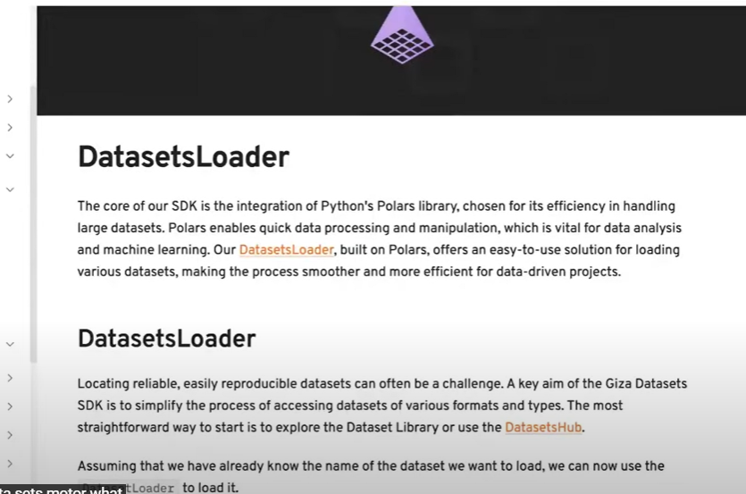
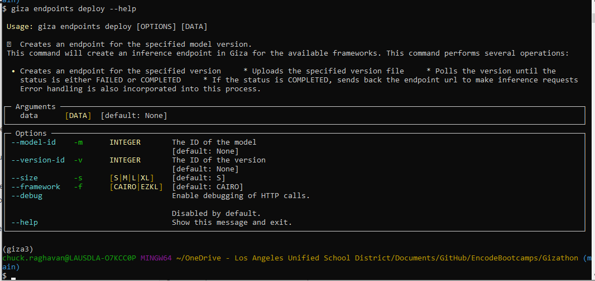

# GizaHackathon

https://x.com/gizatechxyz

https://docs.gizatech.xyz/

https://github.com/gizatechxyz/


Code when registered.

**bq6uees282cg8gx41gbq6ueeqeuoktjv**

## Day 1 - 5/20/24 -  Welcome to Gizathon Agents

https://www.youtube.com/watch?v=U_E_gdeg_uc&t=3137s


i asked question:

https://docs.gizatech.xyz/tutorials/ai-agents


​	


one way to think about trust-minimized ML use-cases in the financial sector is ML as gating logic. Currently in web3 we have radical permissionlessness which makes it very hard for decentralized systems to discern "qualities" of entities which they interact with (users, assets etc). with ML you are able to provide a trust minimized mechanism to overcome this homogeneity.

C

Cem F10:32 AM

the use-cases on the other side are: automated risk budgeted digital assets, decentralized insurance, disintermediated KYC (know-your-peer?) etc. to your question ML serves a key function to provide a "world-model" to decentralized applications (awareness of "reality").

this is obv useful beyond finance (for instance decentralized social, recommender systems, decentralized content moderation etc)


Make sure you have data and reliable.


look for what has public value; not trading bot;

Finding the right models of participation. Right gating criteria.


Are there any examples of use cases with real world assets? -- Not yet.


We are the first hackers!!

as tips! for easy data access when you build your Agents:

\- Datasets: https://docs.gizatech.xyz/products/datasets/hub
\- Model Complexity Reducer: https://docs.gizatech.xyz/tools/auto-zkml


we are the first users touching this product.


https://x.com/gizatechxyz


### Good info

#### Renç | Giza *—* 5/20/24 -Today at 10:51 AM

Sharing all the relevant links we discussed during the first workshop! 

- **Agent Tutorials** (https://docs.gizatech.xyz/tutorials/ai-agents): How to build an agent, step by step
- **Giza Datasets** (https://docs.gizatech.xyz/products/datasets/hub): ML datasets that you can build and train your models with for web3 agents
- **Model Complexity Reducer** (https://www.gizatech.xyz/collection/maximizing-efficiency-with-model-complexity-reducer-(mcr)):  The MCR package provides a robust solution for reducing model complexity while maintaining high performance
- **Giza Twitter** (https://x.com/gizatechxyz): We want to give what you build in the next weeks as much as visibility as possible, mention us on Twitter and tell us what you are building, we will amplify on our channels


### important points - 

- they have some data sets - so we can use that instead of getting our own data??
- train your model - easiest part - automated tools. 
- Intent - integration module for initial experience. 


- leverage their automated tool - best parameters and verifiable proof. 


Q - what are the best use cases - 

- Financial products, structured smart assets - rebalance themselves.
  - Uniswap agent - provides impermanent loss protected account for its users. At the model side it has volatality prediction model & on strategy side it tells if  predictoin is above certain threshold, rebalance my liquidity pool to protect me from impermanant loss.
  - Working on Startnet protocol - yield aggregator where on its core model it has a yield forecasting model where machine leraning model to predict yield in each protocol across all landing protocols on starknet and has an allocation engine that basically combines current yield data and the model prediction to determine the most optimal asset allcation across the various yield avenues. Maximises yield and reduces Txn cost and manages risk efficiently. 
  - also in diff derivatives area. buy future gas contracts. market make gas market.
  - arbitrage agents
  - decentralized social media as example -- farcaster and lens protocol and we can have verifiable... bot indentification and cleanse the platform autonomously.


make sure you data available. meaningful data.

Intent creation and smart contract creation. LP rebalancing; 


needs to have public value.
if you create trading bot to get most - you dont want that public. So not good use case.

Instead create something of public value.


there are no real world asset cases as of now.

we are the 1st developers to do this. 

1st developers to even touch this product.

we are all Giza brains.


## Day 2- 5/22/24 - Full Stack Giza Workshop


https://www.youtube.com/watch?v=BHdP5oSISQE


Timestamps: 

[00:00:00](https://www.youtube.com/watch?v=BHdP5oSISQE&t=0s) Introduction 

[00:02:57](https://www.youtube.com/watch?v=BHdP5oSISQE&t=177s) Giza’s Products 

[00:05:26](https://www.youtube.com/watch?v=BHdP5oSISQE&t=326s) Giza Datasets 

[00:12:42](https://www.youtube.com/watch?v=BHdP5oSISQE&t=762s) ZKML Giza Platform 

[00:14:54](https://www.youtube.com/watch?v=BHdP5oSISQE&t=894s) XGBoost 

[00:31:25](https://www.youtube.com/watch?v=BHdP5oSISQE&t=1885s) Q&A

 [00:45:40](https://www.youtube.com/watch?v=BHdP5oSISQE&t=2740s) Doc Walkaround 

[00:48:53](https://www.youtube.com/watch?v=BHdP5oSISQE&t=2933s) Conclusion


https://docs.gizatech.xyz/


### 3 main products

https://docs.gizatech.xyz/products/all-products


#### Platform

To get ZK proof.

#### AI Agent 

Bridge between zero knowledge machine learning to smart contracts.

#### DataSets

curated library for Web3.


### Datasets


https://docs.gizatech.xyz/products/datasets

takes more than 1/2 of the time to get data.

right data, right format etc. 1/2 the time.

web3 data - challenges - relatively difficult to collect that. you need to know how blockchain works, rpc, smart contracts etc.

Giza datasets is low hanging fruit. valuable tool.


history - all chats if its social platform. etc. 

SDK is ready to run in python.

#### dataset hub


dataset hub and then loader.

#### Dataset Loader





liquidity.


#### Polar vs Panda


#### certifi


#### Eager mode


#### Cache management


### Hub


### Platform 


#### install

https://docs.gizatech.xyz/tutorials/zkml/verifiable-xgboost


##### install giza cli

then install giza agent.


https://docs.gizatech.xyz/welcome/installation

install instrutions


##### then create user account

##### api-key

its optional but highly recommended.


main idea of workshop - 

Train a simple XGBoost model on the diabetes data set.

then we will see how we transpike that into ZK circuit.

Then how to deploy an inference and run a verifiable inference.


#### Create and Train an XGBoost Model


https://docs.gizatech.xyz/tutorials/zkml/verifiable-xgboost

```python
import xgboost as xgb
from sklearn.datasets import load_diabetes
from sklearn.model_selection import train_test_split

data = load_diabetes()
X, y = data.data, data.target

X_train, X_test, y_train, y_test = train_test_split(X, y, test_size=0.2, random_state=42)

# Increase the number of trees and maximum depth
n_estimators = 2  # Increase the number of trees
max_depth = 6  # Increase the maximum depth of each tree

xgb_reg = xgb.XGBRegressor(n_estimators=n_estimators, max_depth=max_depth)
xgb_reg.fit(X_train, y_train)
```


#### Save the model

```python
from giza.zkcook import serialize_model
serialize_model(xgb_reg, "xgb_diabetes.json")
```


#### Transpile your model to Orion Cairo

We will use Giza-CLI to transpile our saved model to Orion Cairo.


```bash
! giza transpile xgb_diabetes.json --output-path xgb_diabetes

>>>>
[giza][2024-05-10 17:14:48.565] No model id provided, checking if model exists ✅
[giza][2024-05-10 17:14:48.567] Model name is: xgb_diabetes
[giza][2024-05-10 17:14:49.081] Model already exists, using existing model ✅ 
[giza][2024-05-10 17:14:49.083] Model found with id -> 588! ✅
[giza][2024-05-10 17:14:49.777] Version Created with id -> 2! ✅
[giza][2024-05-10 17:14:49.780] Sending model for transpilation ✅ 
[giza][2024-05-10 17:15:00.670] Transpilation is fully compatible. Version compiled and Sierra is saved at Giza ✅
⠙ Transpiling Model...
[giza][2024-05-10 17:15:01.337] Downloading model ✅
[giza][2024-05-10 17:15:01.339] model saved at: xgb_diabetes
```


creates instance of model ID and instance of your version.

model ID is 588. Version here is 2.

i think transpiles to Cairo version of XGBoost.

`scab` is the project mgr of Cairo.


we also compiled your Cairo version of the project as intermediary representation of Cairo.


##### 3 platforms support

platform supports 3 kinds of models / frameworks currently to transpile to ZK Circuits.

XGBoost

LightGBM

ONNX - deep learning focused model.

if you do on PyTorch or TensorFlow you can easily convert to onnx and based on that graph transpile from our platform.

##### limitations

https://docs.gizatech.xyz/products/platform/model-compatibility

ONNX is large framework.

big graphs big model. - can become too big.

doc has limitations section

Highly recommend XGBoost


now we are ready to deploy and verify your inference.


#### Deploy an inference endpoint

Now that our model is transpiled to Cairo we can deploy an endpoint to run verifiable inferences. We will use Giza CLI again to run and deploy an endpoint. Ensure to replace `model-id` and `version-id` with your ids provided during transpilation.


```bash
! giza endpoints deploy --model-id 588 --version-id 2

>>>>
▰▰▰▰▰▰▰ Creating endpoint!t!
[giza][2024-05-10 17:15:21.628] Endpoint is successful ✅
[giza][2024-05-10 17:15:21.635] Endpoint created with id -> 190 ✅
[giza][2024-05-10 17:15:21.636] Endpoint created with endpoint URL: https://endpoint-raphael-doukhan-588-2-72c9b3b8-7i3yxzspbq-ew.a.run.app 🎉
```


you get URL - where when we do a Curl request it will run the model - cairo prigram and in parallel start proving job that will run and prove your program.  

For better UX its better create workflow and use directly in your python code. So we created an SDK for that.


#### Run a verifiable inference

To streamline verifiable inference, you might consider using the endpoint URL obtained after transpilation. However, this approach requires manual serialization of the input for the Cairo program and handling the deserialization process. To make this process more user-friendly and keep you within a Python environment, we've introduced a Python SDK designed to facilitate the creation of ML workflows and execution of verifiable predictions. When you initiate a prediction, our system automatically retrieves the endpoint URL you deployed earlier, converts your input into Cairo-compatible format, executes the prediction, and then converts the output back into a numpy object

```python
import xgboost as xgb
from sklearn.datasets import load_diabetes
from sklearn.model_selection import train_test_split

from giza.agents.model import GizaModel


MODEL_ID = 588  # Update with your model ID
VERSION_ID = 2  # Update with your version ID

def prediction(input, model_id, version_id):
    model = GizaModel(id=model_id, version=version_id)

    (result, proof_id) = model.predict(
        input_feed={"input": input}, verifiable=True, model_category="XGB"
    )

    return result, proof_id


def execution():
    # The input data type should match the model's expected input
    input = X_test[1, :]

    (result, proof_id) = prediction(input, MODEL_ID, VERSION_ID)

    print(f"Predicted value for input {input.flatten()[0]} is {result}")

    return result, proof_id


if __name__ == "__main__":
    data = load_diabetes()
    X, y = data.data, data.target

    X_train, X_test, y_train, y_test = train_test_split(
        X, y, test_size=0.2, random_state=42
    )
    _, proof_id = execution()
    print(f"Proof ID: {proof_id}")
```


```bash
🚀 Starting deserialization process...
✅ Deserialization completed! 🎉
(175.58781, '546f8817fa454db78982463868440e8c')
```


returns request ID that can be used to download your proof.


this predict function predicts an inference.


##### `verifiable=True` 

this will actually do the proof part.

for development experience its better sometimes dont start proving job each time.

why - you are limited in times proving jobs you can start in a day etc.


https://docs.gizatech.xyz/products/platform/known-limitations


##### Dry run parameter


will also NOT start the proving job.


#### Download the proof


(175.58781, '546f8817fa454db78982463868440e8c')

returns request ID that can be used to download your proof.


Initiating a verifiable inference sets off a proving job on our server, sparing you the complexities of installing and configuring the prover yourself. Upon completion, you can download your proof.

First, let's check the status of the proving job to ensure that it has been completed.


Remember to substitute `endpoint-id` and `proof-id` with the specific IDs assigned to you throughout this tutorial.

```bash
$ giza endpoints get-proof --endpoint-id 190 --proof-id "546f8817fa454db78982463868440e8c"

>>>
[giza][2024-03-19 11:51:45.470] Getting proof from endpoint 190 ✅ 
{
  "id": 664,
  "job_id": 831,
  "metrics": {
    "proving_time": 15.083126
  },
  "created_date": "2024-03-19T10:41:11.120310"
}
```

Once the proof is ready, you can download it.

```bash
$ giza endpoints download-proof --endpoint-id 190 --proof-id "546f8817fa454db78982463868440e8c" --output-path zk_xgboost.proof

>>>>
[giza][2024-03-19 11:55:49.713] Getting proof from endpoint 190 ✅ 
[giza][2024-03-19 11:55:50.493] Proof downloaded to zk_xgboost.proof ✅ 
```

Better to surround the proof-id in double quotes (") when using the alphanumerical id


#### Verify the proof

Platinum prover.

or verify with Giza verifiable Api.

Finally, you can verify the proof.

Copy

```
$ giza verify --proof-id 664

>>>>
[giza][2024-05-21 10:08:59.315] Verifying proof...
[giza][2024-05-21 10:09:00.268] Verification result: True
[giza][2024-05-21 10:09:00.270] Verification time: 0.437505093
```


Q - what is the proof

A - Cairo proves we executed the program correctly. you did not use anotehr model or bias the result etc. Smart contract can trust you.

proof is NOT done onchain. Only done offChain. Right now its verified offchain but in future we will have verifier onChain.

Prover but still is offChain to save computation.

in the ZKML proof has the program hash, so verify can agree.


How to integrate Agent and smart contract - session tomorrow. 


Q - do the input arguments for the virifiable inference remain private?

A - For the moment we dont handle private inputs. Plan around August. we need to support Noir . now we are Cairo. Cairo hints we can do some privacy. But right now dont.


we dont support YAMA

Big models will fail right now.

Right now best to use XGBoost.


in 2 months we will add OnChain verification.


### Reduce complexity


#### MCR model

https://docs.gizatech.xyz/tools/zkcook


https://github.com/gizatechxyz/zkcook/blob/main/tutorials/reduce_model_complexity.ipynb


complexity reducer.

you pass your model to mcr and it transforms i think.

```python
model, transformer = mcr(model = lgbm_reg,
                         X_train = X_train,
                         y_train = y_train, 
                         X_eval = X_test, 
                         y_eval = y_test, 
                         eval_metric = 'rmse', 
                         transform_features = True)
```


we encourage you to use MCR.

Cairo is adding lot of stuff on top. Thats why right now our models need to be smaller, something like that.

Due to proving being added.


### Benchmark

how much to run , prove etc. 

https://docs.gizatech.xyz/tools/benchmark-cli


### QuickStart

highly recommend start from here.

https://docs.gizatech.xyz/welcome/quickstart


## Session 3- 5/22/24 - Mental Models for ZKML and its Applications


#### Deterministic.


just pipeline of operations.

Input - high dimensional tensor or array.

you feed into this model that does different matrix sort of operations until it gets ouput.

Very simplistic definition.

there are temporal and attention models do little differently.


#### Non-deterministic


Non-deterministic is LLM models - ChatGpt. you get different models.

but its not actually non-deterministic - it has random sample from a deterministic distribution of outputs.

if you give 1000s of prompts you will see some with same output. So output is not deterministic but underlying distribution is.

but ZKML is deterministic.


#### how to Prove

How we can do that?

we are proving this program/model.

Cairo 


Cairo is a generalized turing complete provable language developed by Starkware.

On top of Cairo we have our own ZKML library which is called Orion which used its own numbers, tensors, matric operations etc.

we are not doing proof of training. but in future will be important. 


some models are either blacklisted or whitelisted. 

Credit scoring - you want to prove you are not manipulating the results. So you could have a model that's subscribed to a system & you need to prove to users or regulatory branch that you are using this model and correct model. 


Since its ZKML proof you can either not show the model parameters and/or dont want to show the input itself. You have the freedom to do show.


AI Competitions is example.

i dont want to share my model parameters.

Same finance you dont to share the entire input or the proprietary input. 


Proof generation is more complex than Inference or more computationally expensive is another way to describe it.

Which is much more expensive than proof verification.


So proof Generation you do on Cloud where computation is cheap. and then you send the proof where computation is expensive.

Turns out entire system is cheaper.


Blockchains are expensive. because ML are complex computations.

IoT network, - ML models running there are expensive.

Instead we only send proof there and verification is cheaper.


allows to host that service.

Agent is protocol agnostic.


model owner can be different , agent owner can be different and protocol can be different.

you can recursively improve the model and generate new data.


Q  - where are the agents running?

A - essentially running on Google cloud.  but you can run whereever you want. But right now you are running on our google cloud.

Agent - you ask what's best restaurant in Berlin and it answers but also books reservation. Does some action.

Giza - we are not talking about LLM but ZKML agent. 

So the agent can be used not just model owner. but anyone can use to perform tasks from Agent knowing its verifiable. Acts onChain only when its verified.


## Session 4 - 5/22/24 Fundamentals of On-chain Agents


https://github.com/gizatechxyz/Giza-Hub/blob/main/awesome-giza-agents/uni-v3-lp-agent/model_training.py


https://github.com/gizatechxyz/Giza-Hub/blob/main/awesome-giza-agents/uni-v3-lp-agent/action_agent.py


45:00 - you can have agent interact with any blockchain. its chain agnostic.

we cant run LLMs agent. - too large. 


## Session 5 - 5/24/24 Agents Gizathon Partner Panel


### ZkSynch; 

Vasillis - 

most established L2. 

proud of some of native research we have - 

pay master and account abstraction - 

- agents can tap into those and become more user friendly and more intentional


https://encodeclub.notion.site/Sponsor-Resources-07acb0201a5b4b3ab3a505070e897582


### Starkware;

Lana - 

is behind the Stark protocol; heavily used by companies that scale blockchain.

Language used is Cairo. what is used by Giza models and agents.

Cairo uses stark protocol under the cover. that allows to scale any computation.

real world assets. It need not be all DeFi. you can measure noise pollution, temperature.


### Lambda;

Nick- 

we are infrastructure providers. 

https://lambda.p2p.org/

we run the nodes that people delegate.

multi chain analytics system.

We are trying to support use case - Staking data. we have data set with performance of operators with rewards and they suggest you to predict automating decision to about delegating one of them.

LST protocols and bring more risk. so how to predict.

They will help with domain knowledge.


### Linea

Emily

Evm equivalent ZK rollup bootstrapped by Consensus.

started as research project - at consensus. They own Metamask.

Bezu - of the ETH client is built inhouse at Consensus.

Linea is only multi-client L2.

general purpose chain.

bounty is more creative.

Social & gaming? how does AI fit into.


### Enzyme;

Luca - 

leading protocol in oncHain asset mgmt; used to be known as Melanport.

Disrupt fund mgmt industry & bring it onChain.

one of the use case- 

Definitely automation comes up a lot.

more open Canvas.


Cem Dagdelen (Giza)


vasillis - 

Try to be creative. try to break the rules.

Agent - 1st philosophically and then technology.

right place to experiment.


Lana - 

zoom out. Prove-able code. 

current apps dont have integrity. no accountabilty. With stack we have - giza, cairo, Zk tech, we can demand accountability from ML; 

Value of ZL/ML for the bounty.


Luca - 

you cna create a vault on enzyme that has ability to delegate mgmt to 3rd party who is a human but here can be delegating to the bot. owner of vault can confidently delegate permissions. experiment with asset mgmt.

Asset mgmt personal portfolio or community of people.

Imagine people inputing like Text instruction like the automation and then the AI collects and re-elaborates many different input in sort of social environment and turns that into some of action for benefit of community. 

ex sensin twitter and doing something. 

tomorrow real estate, real world assets.

Composed of diff tokenized  - set of -- 

best onChain Automated mgmt.

me - basket like S&P within the chain.


### Native use Case - 


Lana - ex bridge hack was suspected and they stopped the malicious Txn - censored. Can we do that with provability.


## My idea - 

S&P basket of tokens - 

User just says level 1-10. Risk-reward. keeps it simple for user. - inspired by Emily.

Take the top Market caps only for top 20 tokens in the ecosystem.

and based on current data ML will give the basket.

Also every week re-balances the basket. 


we look at most momentum rising.

Also do some Sharpe analysis if you want to look at Volatality.


### SS-partner - 

Common agreement – insurer hospital entity model. Patient – 

Pressure – consumer is saying – I don’t know what I am paying for. To be transparent.

Privacy and transparency. 

Doctor has 1000 patients. Dataset govt puts up. Predicted price has been XX. Factors counting towards this. 

Dataset somehow get it from public dataset.

Pooled public money;

Insurance company is medicare.

Risk parameters. Either one can be proposer and other acceptor.

Only thing not transparent. --- remote town in New Hampshire.


# INSTALLS

### issues

https://chatgpt.com/share/56c053e3-80df-410b-8e10-b93d2a5433b1


### giza-sdk

### giza-cli


### datasets

### agent

```bash
# conda create -n giza2 python=3.11.0


#did all pip install with --user option on my LA-Laptop.
pip install --user giza-sdk

pip install --user giza-cli

$ conda activate giza3


C:\Users\XX\AppData\Roaming\Python\Python311\Scripts

export PATH="$PATH:/c/Users/chuck.raghavan/AppData/Roaming/Python/Python311/Scripts"


```


### Setup

From your terminal, create a Giza user through our CLI in order to access the Giza Platform:

Copy

```bash
giza users create
user giza1
aol email.


$ giza users create
Enter your username 😎: giza1
Enter your password 🥷 :
Confirm your password 👉🏻 :
Enter your email 📧: r...@aol.com
[giza][2024-05-29 22:29:16.664] Creating user in Giza ✅
[giza][2024-05-29 22:29:17.921] User created ✅. Check for a verification email 📧
```

After creating your user, log into Giza:

Copy

#### giza user

```bash
giza users login

$ giza users login
Enter your username 😎: giza1
Enter your password 🥷 :
[giza][2024-05-29 22:32:13.750] Log into Giza
[giza][2024-05-29 22:32:14.461] Creating default giza dir
[giza][2024-05-29 22:32:14.465] Credentials written to: C:\Users\XX\.giza\.credentials.json
[giza][2024-05-29 22:32:14.469] Successfully logged into Giza ✅
(giza3)
```

*Optional*: you can create an API Key for your user in order to not regenerate your access token every few hours.

Copy

#### gize api-key

```bash
giza users create-api-key

$ giza users create-api-key
[giza][2024-05-29 22:34:07.987] Creating API Key ✅
[giza][2024-05-29 22:34:08.252] API Key written to: C:\Users\XXXX\.giza\.api_key.json
[giza][2024-05-29 22:34:08.260] Successfully created API Key. It will be used for future requests ✅
(giza3)
```


### Jupyter kernel

```bash
$ python -m ipykernel install --name giza3 --display-name "giza3"
C:\Python311\python.exe: No module named ipykernel

$ which python
/c/Users/XX/AppData/Local/anaconda3/envs/giza3/python

/c/Users/XX/AppData/Local/anaconda3/envs/giza3/python -m ipykernel install --name giza3 --display-name "giza3"


$ /c/Users/xxxx/AppData/Local/anaconda3/envs/giza3/python -m ipykernel install --name giza3 --display-name "giza3"
0.01s - Debugger warning: It seems that frozen modules are being used, which may
0.00s - make the debugger miss breakpoints. Please pass -Xfrozen_modules=off
0.00s - to python to disable frozen modules.
0.00s - Note: Debugging will proceed. Set PYDEVD_DISABLE_FILE_VALIDATION=1 to disable this validation.
Installed kernelspec giza3 in C:\ProgramData\jupyter\kernels\giza3
```


### transpile

### Model ID 

### Version

```
$ giza transpile xgb_diabetes.json --output-path xgb_diabetes
[giza][2024-05-29 23:43:03.612] No model id provided, checking if model exists ✅
[giza][2024-05-29 23:43:03.621] Model name is: xgb_diabetes
[giza][2024-05-29 23:43:04.421] Model Created with id -> 665! ✅
[giza][2024-05-29 23:43:05.200] Version Created with id -> 1! ✅
[giza][2024-05-29 23:43:05.208] Sending model for transpilation ✅
[giza][2024-05-29 23:43:16.618] Transpilation is fully compatible. Version compiled and Sierra is saved at Giza ✅
[giza][2024-05-29 23:43:17.750] Downloading model ✅
[giza][2024-05-29 23:43:17.758] model saved at: xgb_diabetes
(giza3)
```


### Deploy an inference endpoint


```bash
giza endpoints deploy --model-id 665 --version-id 1


$ giza endpoints deploy --model-id 665 --version-id 1
▰▱▱▱▱▱▱ Creating endpoint!
[giza][2024-05-29 23:53:51.319] Endpoint is successful ✅
[giza][2024-05-29 23:53:51.335] Endpoint created with id -> 234 ✅
[giza][2024-05-29 23:53:51.346] Endpoint created with endpoint URL: https://endpoint-giza1-665-1-7ee56cfd-7i3yxzspbq-ew.a.run.app 🎉
(giza3)
```


### Ape account 

```
ape accounts generate <account name>
ape accounts generate giza1


$ ape accounts generate giza1
Enhance the security of your account by adding additional random input:
Show mnemonic? [Y/n]: Y
Create Passphrase to encrypt account:
Repeat for confirmation:
INFO: Newly generated mnemonic is:XXXXXXXXXXXXXXXXXXXXXXXXXXXXXXXXXXXXXXX
SUCCESS: A new account '0x39BaE1e8dEc32d94181bCDa1DC25218Ef57a12c2' with HDPath m/44'/60'/0'/0/0 has been added with the id 'giza1'

sent .1 ETH from my other Sepolia;

```


### Create and Agent using the CLI


```bash
giza agents create --model-id <model-id> --version-id <version-id> --name <agent name> --description <agent description>

giza agents create --model-id 665 --version-id 1 --name gizaTest1 --description diabetesTest

--model-id 665 --version-id 1
```


### issues with Pip 

had multiple versions. Finally had it working.

https://chatgpt.com/share/56c053e3-80df-410b-8e10-b93d2a5433b1


```


C:/Users/XX/AppData/Local/anaconda3/envs/giza3/Scripts/pip install varint


```


### Run a verifiable inference


### Download the proof

```bash
$ giza endpoints get-proof --endpoint-id 234 --proof-id "10c164e6c2364ab6b5491702127979a6"

 Endpoint created with id -> 234

$ giza endpoints get-proof --endpoint-id 234 --proof-id "10c164e6c2364ab6b5491702127979a6"
[giza][2024-05-30 00:40:39.691] Getting proof from endpoint 234 ✅
{
  "id": 967,
  "job_id": 1121,
  "metrics": {
    "proving_time": 17.249508
  },
  "created_date": "2024-05-30T07:33:12.532659"
}
(giza3)


Once the proof is ready, you can download it.


$ giza endpoints download-proof --endpoint-id 234 --proof-id "10c164e6c2364ab6b5491702127979a6" --output-path zk_xgboost.proof

>>>>
[giza][2024-03-19 11:55:49.713] Getting proof from endpoint 190 ✅ 
[giza][2024-03-19 11:55:50.493] Proof downloaded to zk_xgboost.proof ✅ 
```


```
$ giza endpoints download-proof --endpoint-id 234 --proof-id "10c164e6c2364ab6b5491702127979a6" --output-path zk_xgboost.proof
[giza][2024-05-30 00:51:52.048] Getting proof from endpoint 234 ✅
[giza][2024-05-30 00:51:53.800] Proof downloaded to zk_xgboost.proof ✅
```


### Verify the proof


```bash
giza verify --proof-id 967

$ giza verify --proof-id 967
[giza][2024-05-30 00:56:05.847] Verifying proof...
[giza][2024-05-30 00:56:07.140] Verification result: True
[giza][2024-05-30 00:56:07.145] Verification time: 0.454667226
(giza3)

```


# Portfolio Manager Project


Sepolia - used chrome - on LL laptop - centralG profile for metamask.


## documentation

### Ape

https://docs.apeworx.io/ape/stable/userguides/accounts.html


https://docs.stackup.sh/docs/supported-erc-20-tokens


### ETH to token swap

https://www.quicknode.com/guides/defi/dexs/how-to-swap-tokens-on-uniswap-with-ethersjs


https://ethereum.stackexchange.com/questions/111799/programmatically-wrap-eth-by-interacting-with-wrapped-ether-contract-in-web3-py


This is WETH mint;

[Sepolia Transaction Hash (Txhash) Details | Etherscan](https://sepolia.etherscan.io/tx/0x93e23ff8660d8ff10be6779cafdfac2cb1a0de03785a7bd996bb24a72ca03c25)


### Create Agent


https://docs.gizatech.xyz/tutorials/ai-agents/using-arbitrum-with-ai-agents

looking at Aritrum example

```bash
giza agents create --endpoint-id <endpoint-id> --name <agent name> --description <agent description>

From earlier Diabetes example- gizaTest1.ipynb
[giza][2024-05-29 23:53:51.335] Endpoint created with id -> 234 ✅

giza agents create --endpoint-id 234 --name gizaTest1 --description diabetesTest
```


## etfXBG.ipynb


### transpile

### Model ID 690

### Version 1

```
$ giza transpile etf_xgb1.json --output-path etf_xgb1
[giza][2024-06-03 19:00:12.216] No model id provided, checking if model exists ✅
[giza][2024-06-03 19:00:12.229] Model name is: etf_xgb1
[giza][2024-06-03 19:00:12.813] Model Created with id -> 690! ✅
[giza][2024-06-03 19:00:13.400] Version Created with id -> 1! ✅
[giza][2024-06-03 19:00:13.413] Sending model for transpilation ✅
[giza][2024-06-03 19:01:06.244] Transpilation is fully compatible. Version compiled and Sierra is saved at Giza ✅
[giza][2024-06-03 19:01:07.583] Downloading model ✅
[giza][2024-06-03 19:01:07.594] model saved at: etf_xgb1
```


### Deploy an inference endpoint

(see later issue and then created again with --size M)

```bash
$ giza endpoints deploy --model-id 690 --version-id 1
▰▰▰▰▱▱▱ Creating endpoint!
[giza][2024-06-03 19:03:08.874] Endpoint is successful ✅
[giza][2024-06-03 19:03:08.880] Endpoint created with id -> 261 ✅
[giza][2024-06-03 19:03:08.882] Endpoint created with endpoint URL: https://endpoint-giza1-690-1-62d762c5-7i3yxzspbq-ew.a.run.app 🎉


```


### Ape account 

already did it.


### Create and Agent using the CLI


```bash
giza agents create --model-id <model-id> --version-id <version-id> --name <agent name> --description <agent description>

giza agents create --model-id 690 --version-id 1 --name etfXGB --description etfXGB


$ giza agents create --model-id 690 --version-id 1 --name etfXGB --description etfXGB
[giza][2024-06-03 19:11:50.498] Creating agent ✅
[giza][2024-06-03 19:11:50.506] Using model id and version id to create agent
[giza][2024-06-03 19:11:50.780] Select an existing account to create the agent.
[giza][2024-06-03 19:11:50.787] Available accounts are:
┌──────────┐
│ Accounts │
├──────────┤
│  giza1   │
└──────────┘
Enter the account name: giza1
{
  "id": 34,
  "name": "etfXGB",
  "description": "etfXGB",
  "parameters": {
    "model_id": 690,
    "version_id": 1,
    "endpoint_id": 261,
    "account": "giza1"
  },
  "created_date": "2024-06-04T02:11:57.598948",
  "last_update": "2024-06-04T02:11:57.598948"
}
```


### Issue - Run Verifiable Inference


Discord question 


#### Gonzalo Mellizo-Soto *—* Today at 3:42 AM

@rchak007 I've checked the endpoint and there are multiple errors:

- Endpoint size is too small and its killing the request due to Out of Memory (OOM), for this I encourage to delete de endpoint `giza endpoints delete -e {endpoint id}` and recreate it with size M `giza endpoints deploy --size M ...`
- Endpoint is panicking with `called Result::unwrap() on an Err value: FromStrError` this usually happens when `model_category` is not defined but I see it in the notebook so maybe is a test
- `Deserialize the request body failed: Error("EOF while parsing a value", line: 1, column: 0)` this is usually because the data is not in the correct format, but the notebook seems to be fine

Remember that you can retrieve the logs with `giza endpoints logs -e {endpoint id}` My take is to perform the first action to recreate the endpoint with a bigger size





#### Deploy an inference endpoint

```bash
giza endpoints delete -e {endpoint id}

$ giza endpoints delete -e 261
[giza][2024-06-04 18:58:56.610] Deleting endpoint 261 ✅
[giza][2024-06-04 18:58:57.122] Endpoint 261 deleted ✅
(giza3)

giza endpoints deploy --size M --model-id 690 --version-id 1

$ giza endpoints deploy --size M --model-id 690 --version-id 1
▰▰▰▰▰▱▱ Creating endpoint!
[giza][2024-06-04 19:01:39.665] Endpoint is successful ✅
[giza][2024-06-04 19:01:39.671] Endpoint created with id -> 269 ✅
[giza][2024-06-04 19:01:39.673] Endpoint created with endpoint URL: https://endpoint-giza1-690-1-ea92df7f-7i3yxzspbq-ew.a.run.app 🎉


giza endpoints delete -e 269
$ giza endpoints delete -e 269
[giza][2024-06-04 19:17:31.463] Deleting endpoint 269 ✅
[giza][2024-06-04 19:17:31.912] Endpoint 269 deleted ✅

giza endpoints deploy --size XL --model-id 690 --version-id 1
$ giza endpoints deploy --size XL --model-id 690 --version-id 1
▰▰▱▱▱▱▱ Creating endpoint!
[giza][2024-06-04 19:18:42.443] Endpoint is successful ✅
[giza][2024-06-04 19:18:42.448] Endpoint created with id -> 270 ✅
[giza][2024-06-04 19:18:42.451] Endpoint created with endpoint URL: https://endpoint-giza1-690-1-ae65a898-7i3yxzspbq-ew.a.run.app 🎉
```


### Create Agent#2 and #3

giza agents create --model-id 690 --version-id 1 --name etfXGB --description etfXGB

```bash
$ giza agents create --model-id 690 --version-id 1 --name etfXGB --description etfXGB
[giza][2024-06-04 19:06:18.403] Creating agent ✅
[giza][2024-06-04 19:06:18.411] Using model id and version id to create agent
[giza][2024-06-04 19:06:18.672] Select an existing account to create the agent.
[giza][2024-06-04 19:06:18.676] Available accounts are:
┌──────────┐
│ Accounts │
├──────────┤
│  giza1   │
└──────────┘
Enter the account name: giza1
{
  "id": 37,
  "name": "etfXGB",
  "description": "etfXGB",
  "parameters": {
    "model_id": 690,
    "version_id": 1,
    "endpoint_id": 269,
    "account": "giza1"
  },
  "created_date": "2024-06-05T02:06:25.417540",
  "last_update": "2024-06-05T02:06:25.417540"
}


For XL;
giza agents create --model-id 690 --version-id 1 --endpoint-id 270 --name etfXGB2 --description etfXGB2


$ giza agents create --model-id 690 --version-id 1 --endpoint-id 270 --name etfXGB2 --description etfXGB2
[giza][2024-06-04 19:24:46.361] Creating agent ✅
[giza][2024-06-04 19:24:46.370] Using endpoint id to create agent, retrieving model id and version id
[giza][2024-06-04 19:24:46.626] Select an existing account to create the agent.
[giza][2024-06-04 19:24:46.629] Available accounts are:
┌──────────┐
│ Accounts │
├──────────┤
│  giza1   │
└──────────┘
Enter the account name: giza1
{
  "id": 40,
  "name": "etfXGB2",
  "description": "etfXGB2",
  "parameters": {
    "model_id": 690,
    "version_id": 1,
    "endpoint_id": 270,
    "account": "giza1"
  },
  "created_date": "2024-06-05T02:24:51.304557",
  "last_update": "2024-06-05T02:24:51.304557"
}
```


### giza agents list

### giza agents delete

```bash
giza agents list
giza agents delete --agent-id 41
```


### giza-BETF-short-LIN-wip.ipynb

this is one that worked for SS.


### ape-linea plug in

linea discord let me know this.


[ape-linea/ape_linea at main · Consensys/ape-linea · GitHub](https://github.com/Consensys/ape-linea)


but got some error - 


So chatGpt asked to install - **Install Microsoft C++ Build Tools**:


Linea Router address Uniswap


### zkSync- Ape


https://github.com/beamer-bridge/beamer/issues/2150


### ZkSync Remix deploy

https://console.chainstack.com/projects


there were 2 plugins;


### zkSync with ape

https://github.com/beamer-bridge/beamer/issues/2150


### Agent run 6/8/24 12:25AM - 

#### Run1


#### Run2


#### Run3 success

6/8/24 - 12:43 am


### Testing


#### 1st screen - 


#### 2nd screen - 

Shows current allocation - then from Model recommended allocation after user "Call Agent and give Rebalance Advise"

This will use the predicted BTC value from the Model which uses ETF inflows to predict this.

Based on BTC value we actually for now use WETH as our investment vehicle which we can assume moves similar to BTC.


#### 3rd screen


##### approve 

INFO:ape:Submitted https://sepolia.etherscan.io/tx/0x83feaa25b642f8908e19990b8d621d705cc0631a092eed113a06b26d2706bf87

##### swap

INFO:ape:Submitted https://sepolia.etherscan.io/tx/0xbe88be90f90fb6383a6f2fb0cafd5b11375a25c0c26a4f6949e739cec5a83d1b


```bash
Current BTC Price: $69322
weth address:  0xfFf9976782d46CC05630D1f6eBAb18b2324d6B14
INFO:agent_logger:Executing contract
Your WETH balance: 0.03
Your WUSDC balance: 13.157838
func is  <function perform_swap at 0x000001F9F83AE3E0>
args are -  0.03 13.157838 0.017473251445257073 59.306379675672936 0xfFf9976782d46CC05630D1f6eBAb18b2324d6B14 0x1c7D4B196Cb0C7B01d743Fbc6116a902379C7238 0x3bFA4769FB09eefC5a80d6E87c3B9C650f7Ae48E 3000 0x39BaE1e8dEc32d94181bCDa1DC25218Ef57a12c2
kwargs are -
WARNING:ape:Using cached key for giza1
INFO:ape:Submitted https://sepolia.etherscan.io/tx/0x83feaa25b642f8908e19990b8d621d705cc0631a092eed113a06b26d2706bf87
WARNING:ape:Using cached key for giza1
INFO:ape:Submitted https://sepolia.etherscan.io/tx/0xbe88be90f90fb6383a6f2fb0cafd5b11375a25c0c26a4f6949e739cec5a83d1b
std out =  target_eth_amount  =  0.017473251445257073
current_eth_balance =  0.03
target_usdc_value =  59.306379675672936
current_usdc_balance=  13.157838
eth diff =  -0.012526748554742926
usdc diff =  46.14854167567294
Swapping 0.012526748554742926 ETH or in Wei 1.2526748554742926e+16
intEthDiff =  12526748554742926
Approving WETH for swap
WARNING: Using cached key for giza1
INFO: Submitted https://sepolia.etherscan.io/tx/0x83feaa25b642f8908e19990b8d621d705cc0631a092eed113a06b26d2706bf87
Caught an exception of type: ProviderError
swap params =  ('0xfFf9976782d46CC05630D1f6eBAb18b2324d6B14', '0x1c7D4B196Cb0C7B01d743Fbc6116a902379C7238', 3000, '0x39BaE1e8dEc32d94181bCDa1DC25218Ef57a12c2', 12526748554742926, 0, 0)
WARNING: Using cached key for giza1
INFO: Submitted https://sepolia.etherscan.io/tx/0xbe88be90f90fb6383a6f2fb0cafd5b11375a25c0c26a4f6949e739cec5a83d1b
Caught an exception of type: ProviderError

Confirmations (2/2): 100%|####################################################################################| 2/2 [00:29<00:00, 14.57s/it]
Confirmations (2/2): 100%|####################################################################################| 2/2 [00:29<00:00, 14.54s/it]

result =  0
```


#### issue reading Pred Value


Test 6/9/24 - 5PM


#### test 6/9/24 - 528 PM


```bash
739
1
Current BTC Price: $69561
st.session_state.input_done =  True
st.session_state.prediction_value =  65000
func is  <function perform_swap at 0x00000171508A8F40>
args are -  0.017473251445257073 18.773477 0.010909963540080699 42.998638290885054 0xfFf9976782d46CC05630D1f6eBAb18b2324d6B14 0x1c7D4B196Cb0C7B01d743Fbc6116a902379C7238 0x3bFA4769FB09eefC5a80d6E87c3B9C650f7Ae48E 3000 0x39BaE1e8dEc32d94181bCDa1DC25218Ef57a12c2
kwargs are -
WARNING:ape:Using cached key for giza1
INFO:ape:Submitted https://sepolia.etherscan.io/tx/0x0fe8689f193b378290a64c2dede5cfb6c020cb1752f259354287d22d0f4c0d3f
WARNING:ape:Using cached key for giza1
INFO:ape:Submitted https://sepolia.etherscan.io/tx/0x3712e6309c08f08a491e5d1f9d6f48822b0e39b6d456357e459c8519c604e71c
std out =  target_eth_amount  =  0.010909963540080699
current_eth_balance =  0.017473251445257073
target_usdc_value =  42.998638290885054
current_usdc_balance=  18.773477
eth diff =  -0.006563287905176374
usdc diff =  24.225161290885055
Swapping 0.006563287905176374 ETH or in Wei 6563287905176374.0
intEthDiff =  6563287905176374
Approving WETH for swap
WARNING: Using cached key for giza1
INFO: Submitted https://sepolia.etherscan.io/tx/0x0fe8689f193b378290a64c2dede5cfb6c020cb1752f259354287d22d0f4c0d3f
Caught an exception of type: ProviderError
swap params =  ('0xfFf9976782d46CC05630D1f6eBAb18b2324d6B14', '0x1c7D4B196Cb0C7B01d743Fbc6116a902379C7238', 3000, '0x39BaE1e8dEc32d94181bCDa1DC25218Ef57a12c2', 6563287905176374, 0, 0)
WARNING: Using cached key for giza1
INFO: Submitted https://sepolia.etherscan.io/tx/0x3712e6309c08f08a491e5d1f9d6f48822b0e39b6d456357e459c8519c604e71c
Caught an exception of type: ProviderError

Confirmations (2/2): 100%|###############################################################################################| 2/2 [00:28<00:00, 14.36s/it]
Confirmations (2/2): 100%|###############################################################################################| 2/2 [00:28<00:00, 14.45s/it]

result =  0
```


https://sepolia.etherscan.io/tx/0x3712e6309c08f08a491e5d1f9d6f48822b0e39b6d456357e459c8519c604e71c


#### test 6/9/24 - 652PM


https://sepolia.etherscan.io/tx/0xf1a56a86571fea90a4ea46f44f67cb5870c48e466134e47e0520707140e42374

https://sepolia.etherscan.io/tx/0x3248d156e6d92a756655b050c1ecee92680a82024e3cb385dbd26518b73a3691


Few issues - 

1) the Predict from Agent works sometims and limit is reached so the screenshots i had to include from before when it worked and also i put exceptiosn to input value.
2) the extraction of value from result with AgentResult never worked for us so had to go with Input value even when Result is return from model.
3) The Ethereum Sepolia SWAP for WETH and USDC pool is probably not reflecting current ETH value. so the formula is based on getting Current ETH value but the pool is not. So for testing purposes does not reflect correctly.
