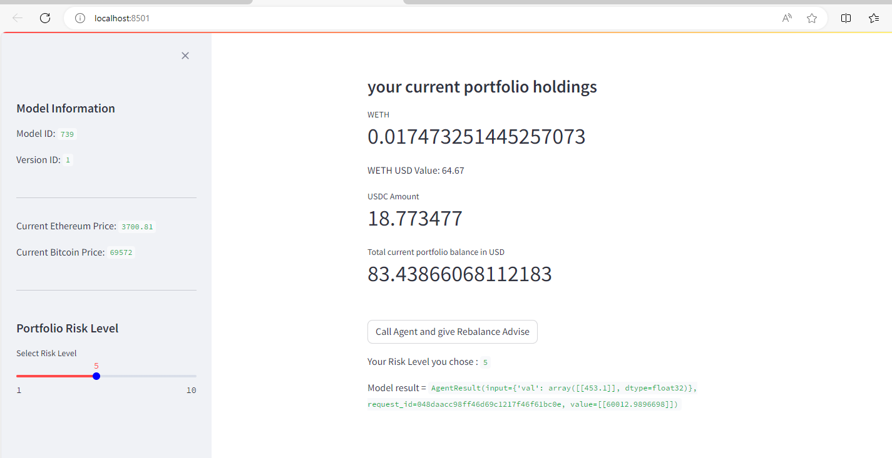
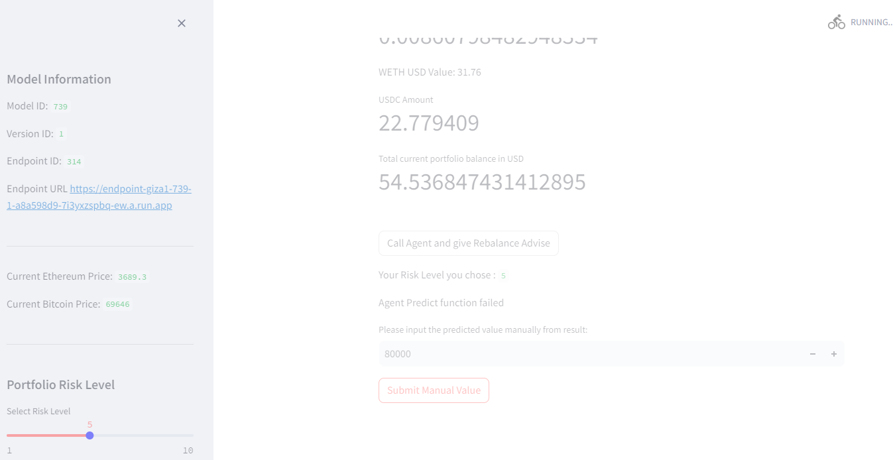

# Integrating AI and Web3 with Giza

## Overview

This project showcases the innovative integration of machine learning (ML) models with blockchain technology to create verifiable predictions that trigger smart contract actions. Using Giza, we bridge the gap between AI and Web3 by training a machine learning model, converting it into a verifiable format, and deploying it to a cloud endpoint. We then create an agent to make predictions with the model and execute smart contracts based on these predictions, all within a Streamlit application for an interactive user experience.

## Objectives

1. **Train an ML Model**: Develop a linear regression model using Scikit-Learn to predict closing prices based on total ETF values.
2. **Transpile the Model**: Convert the trained model into a format that can be verified and deployed using Giza's CLI tools.
3. **Deploy the Model**: Set up a verifiable inference endpoint using Giza, allowing us to call the model for predictions and verify its authenticity.
4. **Create an Agent**: Use Giza to create an agent that makes predictions with the model and triggers smart contracts based on the results.
5. **Run Verifiable Inferences**: Perform predictions and verify that the correct model was used, ensuring trust and transparency in the results.
6. **Interactive Application**: Utilize Streamlit to create a user-friendly interface for interacting with the model and blockchain, displaying real-time data and results.

## Key Components

### 1. Model Training and Transpilation

We start by training a linear regression model on the `BETF-Final.csv` dataset, which contains ETF values and closing prices. The model is then transpiled into an ONNX format using the `skl2onnx` library, making it compatible with Giza's tools for verifiable deployment.

#### Predicting Bitcoin Prices Using Bitcoin ETFs Inflow

##### Overview

In this project, we leverage the inflows of various Bitcoin Exchange-Traded Funds (ETFs) to predict the future price of Bitcoin. The ETFs used in our analysis include:

- IBIT
- FBTC
- BITB
- ARKB
- BTCO
- EZBC
- BRRR
- HODL
- BTCW
- GBTC
- TotalETF

We use the aggregate inflow of these ETFs, represented as `TotalETF`, as a key metric to predict Bitcoin prices. This approach combines the benefits of ETF investment data with machine learning to generate accurate and verifiable price predictions.

##### Why Use Bitcoin ETF Inflows?

Bitcoin ETFs are investment vehicles that allow investors to gain exposure to Bitcoin without directly purchasing the cryptocurrency. The inflows into these ETFs reflect the collective sentiment and interest of investors towards Bitcoin. By analyzing these inflows, we can gauge market trends and investor behavior, which are critical for predicting future price movements. Here are some reasons why Bitcoin ETF inflows are valuable for price prediction:

1. **Market Sentiment Indicator**: The amount of money flowing into Bitcoin ETFs can serve as a proxy for overall market sentiment. High inflows indicate strong investor interest and positive sentiment towards Bitcoin, suggesting potential price increases.
2. **Institutional Investment**: ETFs are often used by institutional investors who have significant market influence. Tracking ETF inflows helps us understand institutional investment trends, which can impact Bitcoin prices significantly.
3. **Liquidity and Demand**: ETF inflows directly affect the liquidity and demand for Bitcoin. High inflows typically increase demand, leading to price appreciation, while outflows can signal reduced interest and potential price declines.
4. **Regulatory Confidence**: The success and popularity of Bitcoin ETFs can also reflect regulatory confidence in Bitcoin as an asset class. Positive regulatory news and approvals often lead to increased ETF inflows and subsequent price hikes.


#### Managing the WETH and USDC Portfolio Ratio

In this project, we not only predict Bitcoin prices using ETF inflows but also actively manage a portfolio consisting of Wrapped Ether (WETH) and USD Coin (USDC). The primary goal is to maintain an optimal balance between WETH and USDC based on the predicted Bitcoin price and the user's risk tolerance. Here’s how we manage the portfolio:

##### Portfolio Balancing Strategy

1. **Risk Level Adjustment**: Users can select their risk level on a scale from 1 to 10. This risk level influences the initial allocation of WETH and USDC in the portfolio. A higher risk level results in a higher allocation to WETH, which is more volatile, while a lower risk level results in a higher allocation to the more stable USDC.
2. **BTC Price Prediction**: The predicted Bitcoin price, derived from the total ETF inflows, is used as a key indicator for future market conditions. By understanding the expected direction and magnitude of Bitcoin's price movement, we can make informed decisions about the portfolio's allocation.
3. **Scaling Factor**: The scaling factor is a parameter used to adjust the influence of the predicted Bitcoin price on the portfolio’s allocation. It ensures that the changes in the portfolio are proportional to the expected returns based on the BTC price prediction. A higher scaling factor means the portfolio will be more sensitive to the predicted Bitcoin price changes.

##### Detailed Allocation Process

1. **Initial Allocation**: Based on the user’s selected risk level, an initial percentage of the total portfolio value is allocated to WETH and USDC.
2. **Expected Return Calculation**: The expected return is calculated using the ratio of the predicted Bitcoin price to the current Bitcoin price. This ratio indicates the potential market movement.
3. **Adjusted Allocation**: The initial allocation percentages are adjusted using the expected return and the scaling factor. This adjustment ensures that the portfolio is rebalanced to reflect the predicted market conditions.
4. **Final Allocation**: The final allocation percentages are then used to determine the exact amounts of WETH and USDC to be held in the portfolio. The rebalancing process involves swapping tokens to achieve these target amounts.

### 2. Model Deployment and Agent Creation

Using Giza's CLI, we deploy the transpiled model to create a verifiable inference endpoint. This endpoint allows us to make predictions and verify that the responses come from the trained model. We then create an agent that interacts with this endpoint, making it possible to call the model and trigger smart contracts based on the predictions.

### 3. Interactive Streamlit Application

The core of our project is an interactive application built with Streamlit. This app enables users to:

- Input data for predictions and see real-time results.
- Fetch current cryptocurrency prices using the CoinGecko API.
- Adjust their portfolio risk levels through an intuitive slider interface.
- View their current portfolio holdings and the recommended adjustments based on the model's predictions.

### 4. Blockchain Interaction

Through the agent, we connect the predictions to smart contract actions on the Ethereum blockchain. The app can:

- Rebalance the portfolio by swapping ETH and USDC tokens based on the model's recommendations.
- Display transaction details and Etherscan URLs for transparency.

## How It Works

1. **Model Training**: We train a linear regression model on historical ETF data to predict closing prices.
2. **Transpilation and Deployment**: The trained model is converted to ONNX format and deployed to a Giza-managed endpoint, ensuring verifiability.
3. **Agent Setup**: We create an agent that interfaces with the deployed model and the Ethereum blockchain.
4. **Streamlit Application**: Users interact with the model and blockchain through a Streamlit app, which fetches real-time data, makes predictions, and triggers smart contract actions.


## Code Files


### Train model, Transpile, deploy Endpoint

https://github.com/rchak007/gizathon/blob/main/giza-BETF-short-LIN-wip.ipynb


### Agent acting on ETH Sepolia Blockchain

https://github.com/rchak007/gizathon/blob/main/gizaAgent-INS-LIN.py


## Commands and Execution

- **Transpile the Model**: `giza transpile linear_regression-betf6.onnx --output-path verifiable_betf_lr6`
- **Deploy the Endpoint**: `giza endpoints deploy --model-id 739 --version-id 1`
- **Create the Agent**: `giza agents create --model-id 739 --version-id 1 --endpoint-id 314 --name BETF6 --description BETF6`
- **Run the Streamlit App**: `streamlit run gizaAgent-INS-LIN.py`


## Benefits and Future Work

By integrating AI and blockchain, we create a system that is not only intelligent but also transparent and trustworthy. Users can confidently rely on the predictions, knowing they are verifiable and tamper-proof. Future enhancements could include:

- Expanding the model to include more features and improve prediction accuracy.
- Integrating additional cryptocurrencies and financial instruments.
- Enhancing the user interface for a more seamless experience.

## Conclusion

This project demonstrates the powerful combination of AI and Web3 technologies. By leveraging Giza's tools, Ape's Web3 components and Streamlit, we create a robust system for making verifiable predictions and executing smart contracts, opening new possibilities for secure and intelligent financial applications.


# TESTING and RESULTS


### List current portfolio

User can click on the Button - Call Agent and Give Rebalance Advise and that will call the agent and get the predicted value for Bitcoin.

WEB UI  also lists current balance of WETH and USDC in the wallet on the left panel.

On the left panel we also have the Model information.

User can also choose the Portfolio Risk Level


### Call Agent for Prediction

Currently we have exhausted the limit of calls. In that scenario we can still give an input of predicted BTC price.


Below here is earlier screen when the Agent gets prediction -




We then for now put the BTC predicted value from agent manually for now.




### Rebalance portfolio recommendation


Due to risk level 5 its advised to get less WETH and a little more USDC.

### perform rebalance on ETH sepolia

now on selecting to `Perform Rebalance` the Agent will now do the swap for WETH/USDC.


### Etherscan URLs:

https://sepolia.etherscan.io/tx/0x7ab2ce46fd9bee07c0bb3ed33622abb865beb8d4783d886546434672fecc756f

https://sepolia.etherscan.io/tx/0xa35b93e53ac4363d9fab90fad61882e15debd6c3194b0737fe2ba593c13a783c


### Final wallet 

now our Metamask wallet also reflects the SWAP update.


### Terminal logs 


on terminal we create some print statements for testing and logging for developers.


```bash
739
1
Current BTC Price: $69646
st.session_state.input_done =  True
st.session_state.prediction_value =  80000
func is  <function perform_swap at 0x000002521A412A20>
args are -  0.00860798482948334 22.779409 0.007940630736367698 25.241478455731546 0xfFf9976782d46CC05630D1f6eBAb18b2324d6B14 0x1c7D4B196Cb0C7B01d743Fbc6116a902379C7238 0x3bFA4769FB09eefC5a80d6E87c3B9C650f7Ae48E 3000 0x39BaE1e8dEc32d94181bCDa1DC25218Ef57a12c2
kwargs are -
WARNING:ape:Using cached key for giza1
INFO:ape:Submitted https://sepolia.etherscan.io/tx/0x7ab2ce46fd9bee07c0bb3ed33622abb865beb8d4783d886546434672fecc756f
WARNING:ape:Using cached key for giza1
INFO:ape:Submitted https://sepolia.etherscan.io/tx/0xa35b93e53ac4363d9fab90fad61882e15debd6c3194b0737fe2ba593c13a783c
std out =  target_eth_amount  =  0.007940630736367698
current_eth_balance =  0.00860798482948334
target_usdc_value =  25.241478455731546
current_usdc_balance=  22.779409
eth diff =  -0.0006673540931156421
usdc diff =  2.4620694557315446
Swapping 0.0006673540931156421 ETH or in Wei 667354093115642.1
intEthDiff =  667354093115642
Approving WETH for swap
WARNING: Using cached key for giza1
INFO: Submitted https://sepolia.etherscan.io/tx/0x7ab2ce46fd9bee07c0bb3ed33622abb865beb8d4783d886546434672fecc756f
Caught an exception of type: ProviderError
swap params =  ('0xfFf9976782d46CC05630D1f6eBAb18b2324d6B14', '0x1c7D4B196Cb0C7B01d743Fbc6116a902379C7238', 3000, '0x39BaE1e8dEc32d94181bCDa1DC25218Ef57a12c2', 667354093115642, 0, 0)
WARNING: Using cached key for giza1
INFO: Submitted https://sepolia.etherscan.io/tx/0xa35b93e53ac4363d9fab90fad61882e15debd6c3194b0737fe2ba593c13a783c
Caught an exception of type: ProviderError

Confirmations (2/2): 100%|###############################################################################################| 2/2 [00:29<00:00, 14.50s/it]
Confirmations (2/2): 100%|###############################################################################################| 2/2 [00:50<00:00, 25.35s/it]

result =  0
```


### Notes/Assumptions/Issues

- currently the Swap Router for WETH/USDC pool does not reflect current prices that's why at this point this is just demo and only WETH shows correct status. In live Mainnet you would get correct rebalance. 
- Right now even when Agent gets the prediction the value extraction from AgentResult class object is not working and need to be worked out with Gize. That's why the app has manual input of the BTC prediction price.
- Currently the BTC price prediction model is simplified - in future we have to make these predictions more robust but this project was just to execute the concept.


